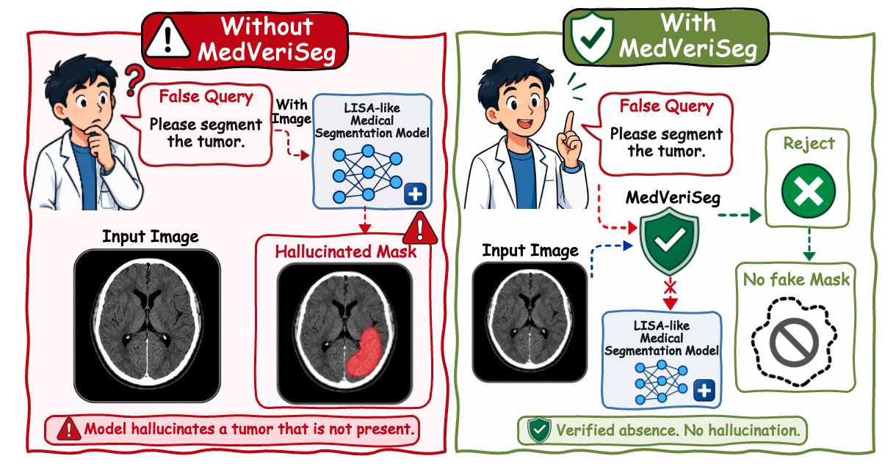

<p align="center">

  <h2 align="center">
  MedVeriSeg: Teaching LISA-Like Medical Segmentation Models to Verify Query Validity Without Extra Training


</h2>
<div align="center">
  <p>
    <a><strong>Qinyue Tong</strong></a><sup>1</sup>
    ·
    <a><strong>Xiaozhen Wang</strong></a><sup>2</sup>
    ·
    <a href="https://scholar.google.com/citations?user=qx1yRVEAAAAJ&hl=zh-CN"><strong>Ziqian Lu</strong></a><sup>3</sup>
    <br>
    <a><strong>Jun Liu</strong></a><sup>1</sup>
    ·
    <a><strong>Yunlong Yu</strong></a><sup>1</sup>
    ·
    <a href="https://person.zju.edu.cn/lzmhome"><strong>Zheming Lu</strong></a><sup>1</sup>
    <br>
    <sup>1</sup>Zhejiang University, 
    <sup>2</sup>Southern Medical University, 
    <sup>3</sup>Zhejiang Sci-Tech University
    <br>
    🧑‍💼 <b><i>Project Leader: Prof. Zheming Lu</i></b>
  </p>

  <a href="https://arxiv.org/abs/2604.10242">
    
  </a>
</div>
  


## :mega: News
- **2026.6.08**: 🔥🔥🔥We have uploaded the code for **MedVeriSeg**. It includes the implementation of the Similarity Response Quality Scoring Module and the Lightweight Routed Multi-Agent Verification module. You can select any LISA-like medical segmentation model as the backbone and integrate our method into it.
- **2026.6.05**: We’ve uploaded our paper *MedVeriSeg: Teaching LISA-Like Medical Segmentation Models to Verify Query Validity Without Extra Training* to arXiv and set up this repository! Welcome to **watch** 👀 this repository for the latest updates.


## :memo: ToDo List
- [x] Release ***MedVeriSeg codes***.
- [ ] Release ***MedVeriSeg-Bench*** benchmark.


## Getting Started and Installation

**1. Prepare the code and the environment**

Git clone our repository, creating a python environment and activate it via the following command

```bash
git clone https://github.com/Edisonhimself/MedVeriSeg.git
cd MedVeriSeg
conda env create -f environment.yml
conda activate medveriseg
```


**2. Prepare the segmentation model backbone**

**MedVeriSeg** is based on lisa-like medical segmentation model. Please first select the model backbone you want to use.


**3. Prepare the similarity matrix computation code**

We use the similarity matrix computation code from **READ**. You can refer it at [READ](https://github.com/rui-qian/READ).


**3. Use our MedVeriSeg**

After obtaining the similarity matrix and the corresponding similarity heatmap, you can use **MedVeriSeg** to verify whether the queried target actually exists in the medical image.

First, compute the three quantitative indicators from the similarity map with `presence_judge.py`:

- `S`: similarity strength
- `C`: similarity compactness
- `P`: similarity purity

These scores are used as the quantitative evidence for query-validity verification. The released implementation expects a flattened similarity tensor whose length can be reshaped into a square 2D map.

Then, run MedVeriSeg with the original image, the similarity heatmap, the target class text, and the computed `S`, `C`, and `P` values:

```bash
export OPENAI_API_KEY="your_api_key"
export OPENAI_BASE_URL="your_openai_compatible_api_base_url"

python MedVeriSeg/test_release.py \
  --original-image path/to/original_image.png \
  --heatmap path/to/similarity_map.png \
  --class-text "target anatomy or lesion name" \
  --S xxxx \
  --C xxxx \
  --P xxxx \
  --output-json path/to/output.json
```

For batch evaluation, organize the results as follows:

```text
result_root/
├── negative/
│   └── item_xxxxxx/
│       ├── data.json
│       ├── original_image.png
│       └── similarity_map.png
└── positive/
    └── item_xxxxxx/
        ├── data.json
        ├── original_image.png
        └── similarity_map.png
```

Each `data.json` should contain `original_jsonl_item.class_text` and `similarity_metrics` with `S`, `C`, and `P`. You can then run:

```bash
python github_release_version/test_release.py \
  --root path/to/result_root \
  --record-dir path/to/result_root/record
```

The script first applies the quantitative rule. If the quantitative evidence is decisive, no vision-language agent is called. Otherwise, MedVeriSeg activates the multi-agent verification process using the original image, heatmap, and quantitative evidence, and saves the final decision together with intermediate evidence cards.


## :clap: Acknowledgements
This project is developed on the codebase of [MediSee](https://github.com/Edisonhimself/MediSee) and [READ](https://github.com/rui-qian/READ). We appreciate their valuable contributions! 

## :love_you_gesture: Citation
If you find our paper is helpful for your research, please consider citing:
```BibTeX
@article{tong2026medveriseg,
  title={MedVeriSeg: Teaching LISA-Like Medical Segmentation Models to Verify Query Validity Without Extra Training},
  author={Tong, Qinyue and Wang, Xiaozhen and Lu, Ziqian and Liu, Jun and Yu, Yunlong and Lu, Zheming},
  journal={arXiv preprint arXiv:2604.10242},
  year={2026}
}
```
